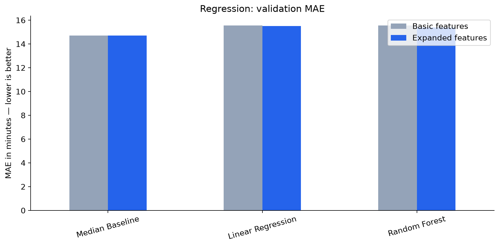
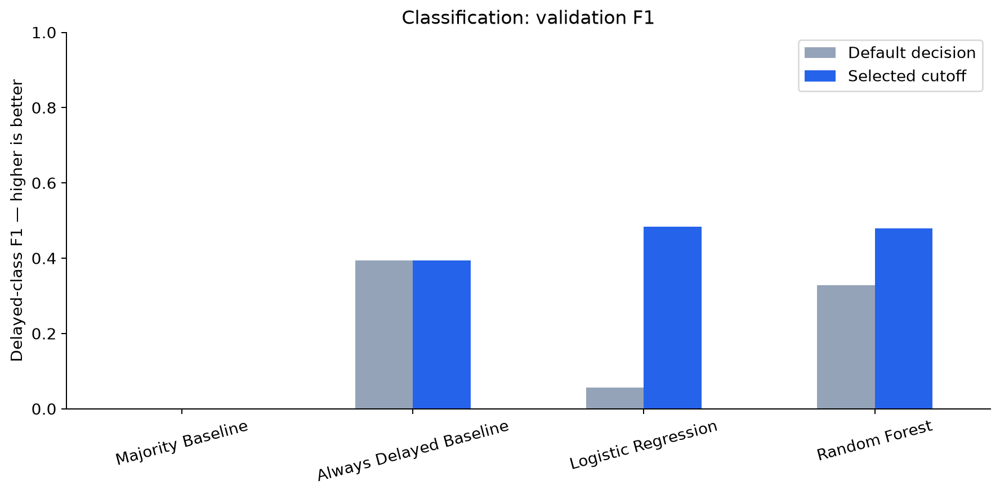
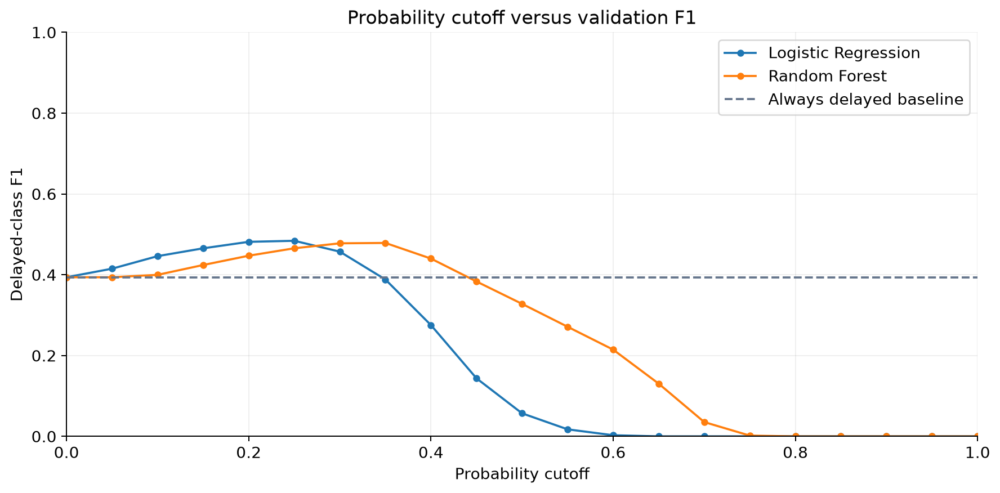
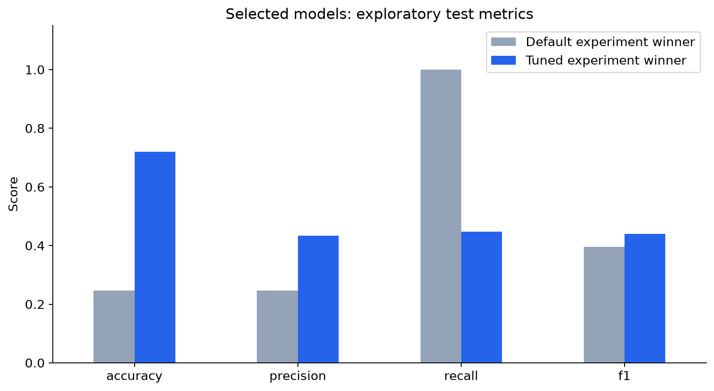
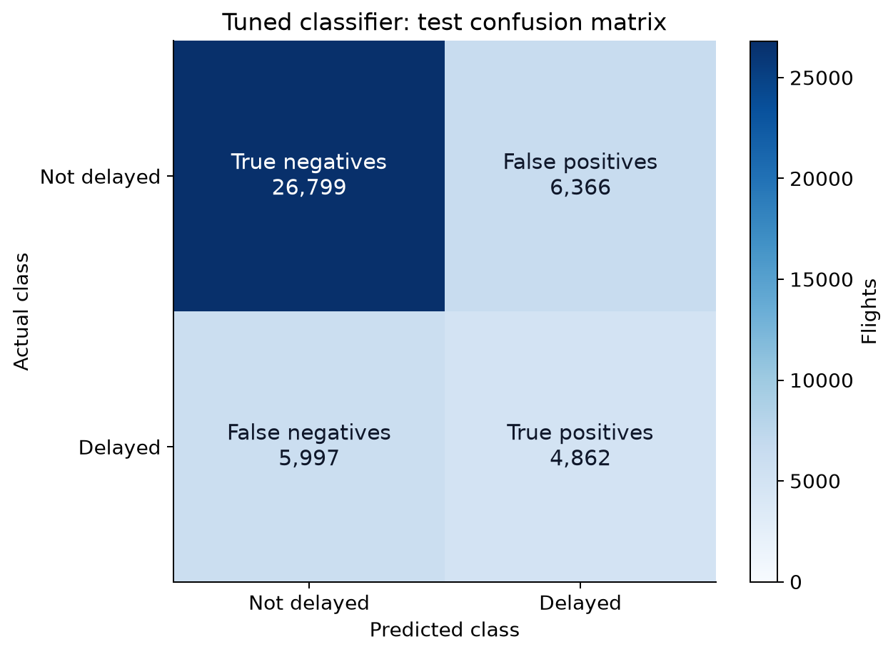

# Flight Delay Prediction: Experiment Report

This report follows the project from basic regression to
threshold-tuned classification.

**All result tables and graphs are generated from saved CSV files.**
The explanations describe the implemented experiments.

## Final recorded result

The tuned experiment selected **Logistic Regression**, using a
probability cutoff of **0.25**.

| Test metric | Recorded value |
|---|---:|
| Precision | 0.433 |
| Recall | 0.448 |
| F1 | 0.440 |
| Accuracy | 0.719 |

Test F1 changed by **+0.045** compared with the default
classification experiment's selected model.

The saved tuned predictions cover **44,024 flights**, from
**2023-05-27** through
**2024-12-31**.

> Test scores are exploratory because the test period was inspected
> across experiments. Model and cutoff selection used validation data.

## 1. Data and cleaning

The source is a
[Bureau of Transportation Statistics departure report](https://www.transtats.bts.gov/ONTIME/Departures.aspx)
covering Southwest flights departing LAX.

[The cleaning script](../src/clean_data.py):

- Skips the seven report lines above the CSV header.
- Retains flight date, destination, scheduled time, and delay.
- Removes missing required values.
- Parses dates and scheduled departure times.
- Creates weekday and departure-hour features.
- Removes rows with unsuccessful date/time parsing.

Cleaned data is saved to `data/processed/flights_clean.csv`.

Actual departure delay is an outcome, never a model input.

## 2. Evaluation design

The training scripts sort flights chronologically and split
distinct flight dates:

- First 60% of dates: training.
- Next 20%: validation.
- Final 20%: testing.

All flights on the same date stay together. The percentages refer
to dates rather than flight counts.

Encoders and scalers are fitted within training pipelines.

## 3. Experiment 1: Basic regression

[Implementation](../src/train_basic_models.py)

### Goal

Predict departure delay in minutes using destination, weekday,
and scheduled departure hour.

### Approaches

- Median baseline: predict the training median delay.
- Linear Regression.
- Random Forest Regressor.

Models were selected using validation mean absolute error (MAE).
MAE measures average absolute prediction error in minutes.
Lower is better.

### Saved results

| model             |   validation_mae_minutes |   test_mae_minutes | selected   |
|:------------------|-------------------------:|-------------------:|:-----------|
| Median Baseline   |                   14.711 |             14.609 | True       |
| Linear Regression |                   15.568 |             15.379 | False      |
| Random Forest     |                   15.560 |             15.324 | False      |

The `selected` column records the validation winner. Test scores
were not used to retroactively select a different model.

## 4. Experiment 2: Expanded features

[Feature engineering](../src/feature_engineering.py) |
[Training](../src/train_improved_models.py)

This experiment added:

- Year and month.
- Weekend indicator.
- Minute-level scheduled timing.
- Daily, weekly, and monthly sine/cosine features.

Cyclical features represent repeating patterns, making the end
and start of a cycle adjacent.

The expanded models use minutes since midnight. Departure minute
is saved in the feature CSV but is not a separate model input.

These features re-express existing date/time information.
They do not introduce weather or operational disruption data.

Output: `data/processed/flights_features.csv`.

### Validation comparison

| model             |   validation_mae_minutes_basic |   validation_mae_minutes_expanded |   mae_reduction_minutes |
|:------------------|-------------------------------:|----------------------------------:|------------------------:|
| Median Baseline   |                         14.711 |                            14.711 |                   0.000 |
| Linear Regression |                         15.568 |                            15.520 |                   0.048 |
| Random Forest     |                         15.560 |                            15.401 |                   0.159 |

Positive MAE reduction means the expanded features helped.

### Expanded-feature results

| model             |   validation_mae_minutes |   test_mae_minutes | selected   |
|:------------------|-------------------------:|-------------------:|:-----------|
| Median Baseline   |                   14.711 |             14.609 | True       |
| Linear Regression |                   15.520 |             14.383 | False      |
| Random Forest     |                   15.401 |             16.450 | False      |

The regression models were refitted on training plus validation
after validation-based selection.

## 5. Experiment 3: Delay classification

[Implementation](../src/train_delay_classifier.py)

### New question

Will a flight depart **at least 15 minutes late**?

Class 1 means a departure delay of at least 15 minutes.
Class 0 includes early, on-time, and less-than-15-minute-late flights.

The actual delay and classification label are excluded from inputs.

### Models

- Majority-class baseline.
- Always-delayed baseline.
- Logistic Regression with balanced class weights.
- Random Forest Classifier with balanced class weights.

### Metrics

| Metric | Meaning |
|---|---|
| Precision | Fraction of delay warnings that were correct |
| Recall | Fraction of actual delayed flights caught |
| F1 | Harmonic mean of precision and recall |
| Accuracy | Fraction of all predictions that were correct |

Precision, recall, and F1 refer to the delayed class.

### Default validation results

| model                   |   accuracy |   precision |   recall |    f1 | selected   |
|:------------------------|-----------:|------------:|---------:|------:|:-----------|
| Majority Baseline       |      0.755 |       0.000 |    0.000 | 0.000 | False      |
| Always Delayed Baseline |      0.245 |       0.245 |    1.000 | 0.394 | True       |
| Logistic Regression     |      0.752 |       0.416 |    0.031 | 0.057 | False      |
| Random Forest           |      0.727 |       0.413 |    0.272 | 0.328 | False      |

### Selected model's test results

| model                   |   accuracy |   precision |   recall |    f1 |
|:------------------------|-----------:|------------:|---------:|------:|
| Always Delayed Baseline |      0.247 |       0.247 |    1.000 | 0.396 |

This script refitted the selected model on training plus validation
before test evaluation.

## 6. Experiment 4: Threshold tuning

[Implementation](../src/train_tuned_delay_classifier.py)

A classifier score becomes a warning when it reaches a selected
probability cutoff.

The experiment searched cutoffs from 0.00 to 1.00 in steps of
0.05, using validation F1.

Baseline behavior stayed fixed. Exact F1 ties were broken using
higher precision, then higher cutoff.

Lower cutoffs generally catch more delays but create more false
alarms. With balanced class weights, classifier scores are not
assumed to be calibrated real-world probabilities.

### Best validation cutoff for each model

| model                   |   threshold |   accuracy |   precision |   recall |    f1 | selected   |
|:------------------------|------------:|-----------:|------------:|---------:|------:|:-----------|
| Logistic Regression     |       0.250 |      0.609 |       0.358 |    0.749 | 0.484 | True       |
| Random Forest           |       0.350 |      0.607 |       0.355 |    0.736 | 0.479 | False      |
| Always Delayed Baseline |       0.500 |      0.245 |       0.245 |    1.000 | 0.394 | False      |
| Majority Baseline       |       0.500 |      0.755 |       0.000 |    0.000 | 0.000 | False      |

### Default versus tuned validation F1

| model                   |   f1_default |   f1_tuned |   threshold |
|:------------------------|-------------:|-----------:|------------:|
| Majority Baseline       |        0.000 |      0.000 |       0.500 |
| Always Delayed Baseline |        0.394 |      0.394 |       0.500 |
| Logistic Regression     |        0.057 |      0.484 |       0.250 |
| Random Forest           |        0.328 |      0.479 |       0.350 |

### Actual recorded threshold sweep

This graph reads every tested cutoff from
`results/classification_tuned/threshold_results.csv`.

The selected model was not refitted after choosing its cutoff.
The fitted pipeline used for validation was also used for testing.

## 7. Final exploratory test evaluation

| model               |   threshold |   accuracy |   precision |   recall |    f1 |
|:--------------------|------------:|-----------:|------------:|---------:|------:|
| Logistic Regression |       0.250 |      0.719 |       0.433 |    0.448 | 0.440 |

The graph compares the selected models from the default and tuned
experiments. Their procedures differ: the default winner was
refitted, while the tuned winner was not.

### Confusion matrix

| actual_class       |   predicted_not_delayed |   predicted_delayed |
|:-------------------|------------------------:|--------------------:|
| actual_not_delayed |                   26799 |                6366 |
| actual_delayed     |                    5997 |                4862 |

The final model:

- Caught **4,862 delayed flights**.
- Missed **5,997 delayed flights**.
- Produced **6,366 false delay warnings**.
- Correctly identified **26,799 flights below the delay cutoff**.

Predicting every test flight not delayed would achieve
**75.3% accuracy**, while catching no delays.

Accuracy must therefore be considered alongside precision,
recall, and F1.

## 8. Recorded classification features

This list comes from the saved classification feature file.
The supplied default and tuned scripts use the same inputs.

| feature                |
|:-----------------------|
| Destination Airport    |
| day_of_week            |
| month                  |
| departure_hour         |
| year                   |
| is_weekend             |
| minutes_since_midnight |
| departure_time_sin     |
| departure_time_cos     |
| day_of_week_sin        |
| day_of_week_cos        |
| month_sin              |
| month_cos              |

## 9. Implementation and artifacts

| File | Responsibility |
|---|---|
| [clean_data.py](../src/clean_data.py) | Data cleaning |
| [train_basic_models.py](../src/train_basic_models.py) | Basic regression |
| [feature_engineering.py](../src/feature_engineering.py) | Additional features |
| [train_improved_models.py](../src/train_improved_models.py) | Expanded regression |
| [train_delay_classifier.py](../src/train_delay_classifier.py) | Default classification |
| [train_tuned_delay_classifier.py](../src/train_tuned_delay_classifier.py) | Cutoff selection |
| [generate_experiment_report.py](../src/generate_experiment_report.py) | Report generation |

| Experiment | Results folder |
|---|---|
| Basic regression | `results/` |
| Expanded regression | `results/improved/` |
| Default classification | `results/classification/` |
| Tuned classification | `results/classification_tuned/` |

The final bundle is saved at:

`models/classification_tuned/flight_delay_classifier_bundle.joblib`

It stores the fitted pipeline, cutoff, feature names, and delay
definition. Future predictions must use the saved cutoff.

## 10. Lessons and limitations

- Baselines show whether trained models add value.
- More features do not automatically improve predictions.
- Regression MAE and classification F1 answer different questions.
- The cutoff changes the balance between false alarms and missed delays.
- Accuracy alone can hide failure to detect delayed flights.
- Weather, congestion, and incoming-aircraft delays were not included.
- Cancellations and diversions are not separate prediction targets.
- Pandemic-era and later travel patterns may differ.
- Test scores are exploratory because the period was inspected repeatedly.

The project demonstrates cleaning, chronological evaluation,
baseline comparisons, feature engineering, regression,
classification, cutoff selection, and model persistence.

## Updating this report

Run `python src/generate_experiment_report.py` from the project root.

The generator reads saved outputs and does not train models.
When experiments change, regenerate their results first.

The confusion matrix is checked against saved predictions.
This does not verify that all experiment outputs use the same
dataset version; keep results from consistent runs.
